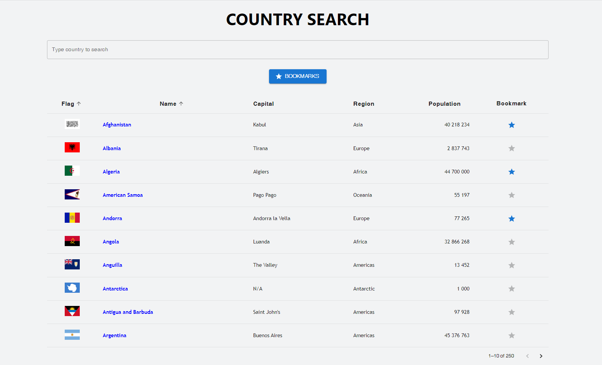
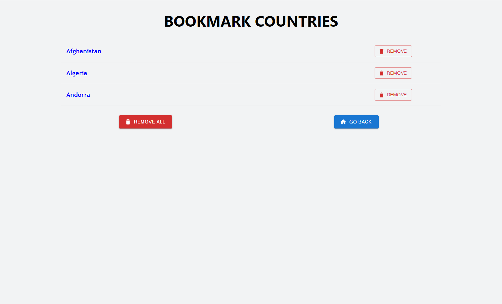
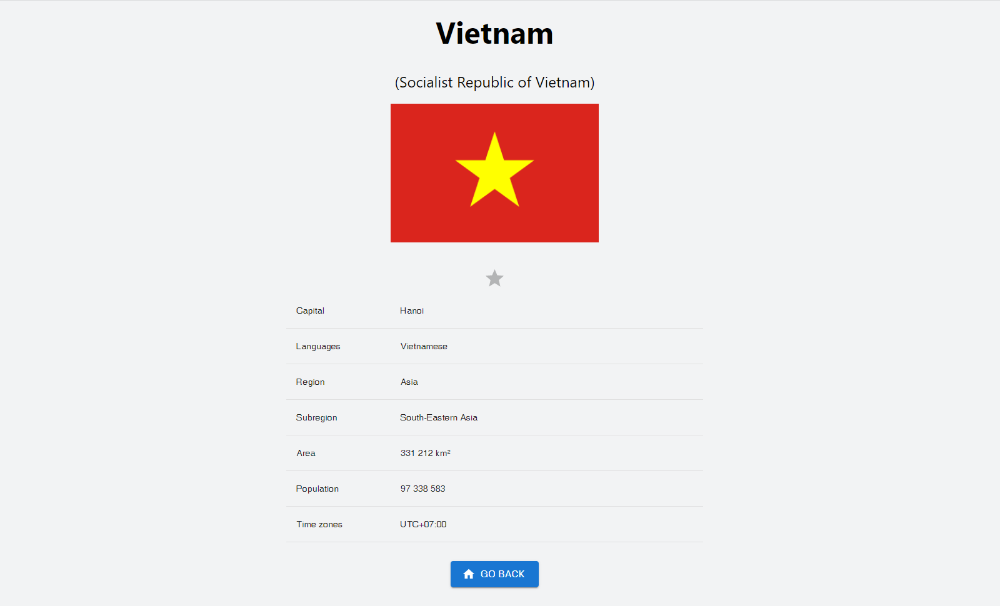

# Frontend React Project - REST Countries Search

A site that display data from all countries around the world, using REST Countries API.

## Features

### Search

Users can search the country that they are looking for by using the search bar. Does not matter the first letter, as long as the search input is in order (for example: type "rman", and "Germany" still appears in the result)

### Sorting

Sort countries list by name, population, capital and region. Default sorting is by name.

### Display bookmark countries

Users are able to bookmark favorite country/countries. They can be seen in the bookmark page. In the bookmark page, there's also an option to remove one or all the countries.

## References

[Demo](https://longdo-rest-countries-search.netlify.app)

Homepage:

Bookmark page:

Country page:

